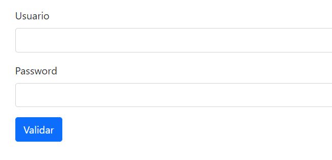
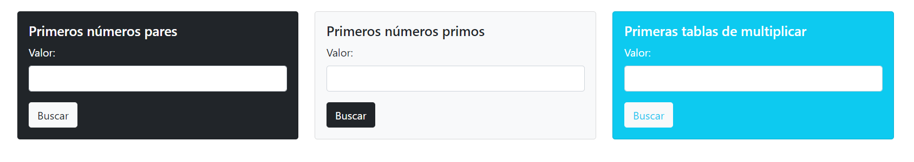
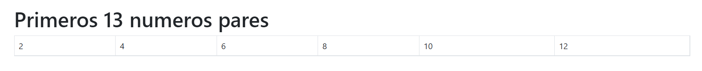
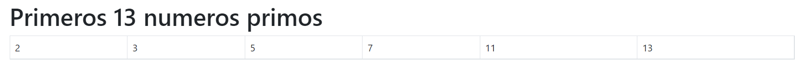
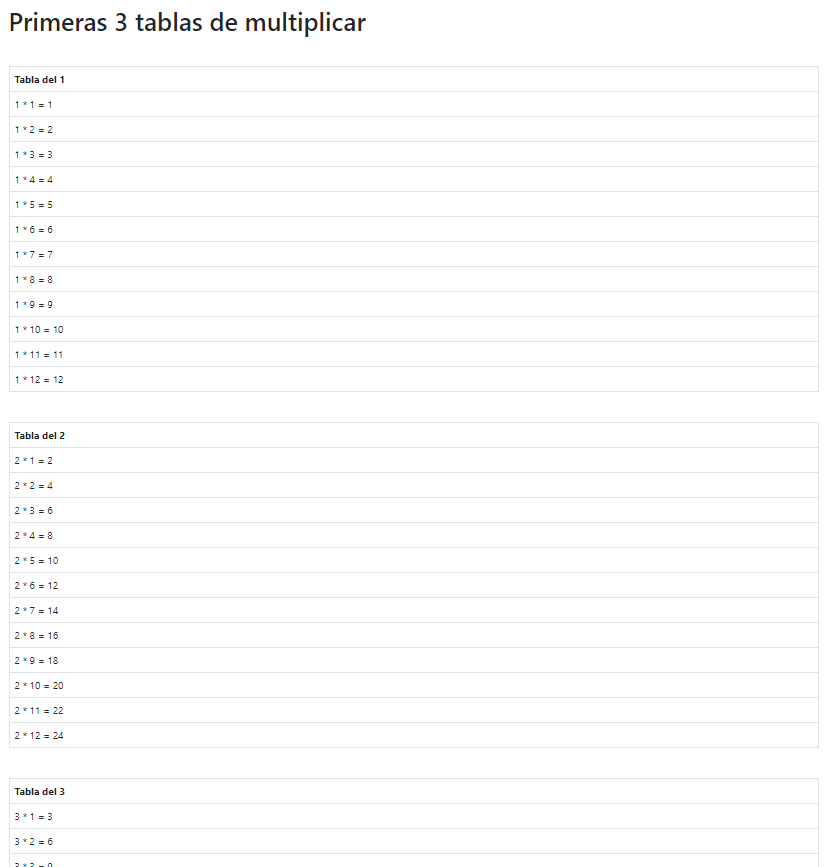

# Web Application 🚀

This application is made in Java, where I implement Servlets for functionality. 

## Explanation of functionality 📋

- A servlet that prints the first n even numbers.
- A servlet that prints the first n prime numbers.
- A servlet that prints the first n multiplication tables.

These 3 servlets are listed in a file called servlets.html, which is accessed after validation.

I included in the document index.html the data for the respective validation, such as username and password. If the validation is correct, the servlets.html file will be shown, otherwise a form will be shown indicating what exactly the error is, if in the user, or in the provided key. 

Allowing others to reload the page to perform the respective login.
> 📝 Note: "n" is a number sent through a form. 

## Usage

Pagina de validacion de usuario y contraseña

Pagina de acceso a los serverlts

Pagina de los primeros n numeros pares

Pagina de los primeros n numeros primos

Pagina de las primeras n tablas de multiplicar

## 📝 License 
[MIT](https://choosealicense.com/licenses/mit/)